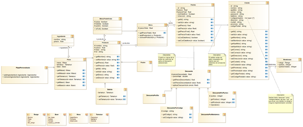

# GetPizza - Gestión de pizzería
Especificación de requisitos del software (SRS)

1. Introducción

  Este documento es una Especificación de Requisitos Software (ERS) para el
  sistema GetPizza. Esta especificación se ha estructurado basándose en las
  directrices dadas por el estándar IEEE "Práctica Recomendada para
  Especificaciones de Requisitos Software IEEE 830, 1998".

  

  1.1 Propósito

  Este proyecto tiene como objetivo crear una aplicación de escritorio con la cual
  poder pedir comida a domicilio, con la facilidad de no tener que visitar la tienda
  físicamente. Esta aplicación va dirigida a un público con poca disponibilidad o tiempo
  libre limitado que busque poder comer de forma cómoda y rápida teniendo la
  posibilidad de poder pagar el pedido en efectivo o con datáfono cuando el repartidor
  lo entregue.

  

  1.2 Alcance

  El presente documento pretende definir las especificaciones de un sistema de
  información que gestiona por medio de credenciales inteligentes el acceso a
  visualizar menús, pedir comida a domicilio, acumular ofertas y conseguir un rango
  de membresía por medio de un sistema de puntos el cual será premiado por el
  sistema con descuentos.

  El sistema GetPizza se centra en la gestión de visualizar menús, pedidos de
  comida a domicilio, acumulación de ofertas y el otorgamiento de un rango de
  membresía por medio de un sistema de puntos. El sistema está diseñado para ser
  utilizado por los clientes de la pizzería y se basa en el uso de credenciales
  inteligentes para garantizar la seguridad y privacidad de los usuarios.

  

  1.3 Visión general del documento

  Este documento quiere dar una descripción general sobre el sistema, el cual está
  estructurado de acuerdo a las directrices proporcionadas por el estándar IEEE 830
  para Especificaciones de Requisitos Software. El documento contiene una
  descripción general del sistema, incluyendo la perspectiva del producto, las
  características de los usuarios, la descripción fundamental, las entidades de datos
  principales, las restricciones y las suposiciones y dependencias. Además, se
  incluyen los diagramas UML, los requisitos específicos del sistema, que se dividen
  en casos de uso y requisitos comunes de las interfaces.

2. Descripción general

  2.1 Perspectiva del producto

  GetPizza es un sistema orientado a la realización de pedidos de un restaurante
  de pizzas, el cual consta de una aplicación para dispositivo móvil o de escritorio para la
  versión de ordenador de uso único para los clientes.

  

  2.2 Características de los usuarios

  El sistema GetPizza permite a los clientes gestionar sus pedidos de comida a
  domicilio de forma eficiente. Los clientes comienzan el proceso iniciando sesión o
  registrándose en el sistema para acceder a una variedad de opciones, incluyendo la
  visualización de menús, la modificación de datos, la acumulación de ofertas o la
  obtención de una membresía por acumulación de puntos. Para realizar un pedido se
  añaden los productos, se escogen las ofertas y una forma de entrega. Por último, se
  pregunta el método de pago, bien pudiendo elegir que el repartidor lleve un datáfono
  para poder realizar el pago por tarjeta; o sin datáfono, para pagar en efectivo cuando el
  repartidor lleve el pedido.

  Los casos de uso empleados para definir este proyecto son los siguientes en
  orden: 1) Registro en el sistema 2) Inicio de sesión 3) Modificación de datos 4) Visualizar
  carta 5) Visualizar membresía 6) Realizar pedido 7) Ver estado del pedido 8) Finalizar
  el pedido.

  

​		2.3 Descripción fundamental

| Tipo de usuario | Cliente                                                      |
| :-------------- | ------------------------------------------------------------ |
| Acciones        | Registrarse, iniciar sesión, modificar datos, visualizar carta,  visualizar membresía, aplicar descuentos, realizar, ver estado del pedido y finalizar el pedido. |

​		

​		2.4 Entidades de datos principales

​						⮚ Cliente (id, nombre completo, dirección, correo, password, teléfono, códigosUsados)

​						⮚ Pedido (id, precio, precioFinal, estado, conDatafono, nota)

​						⮚ Descuento (tipos de descuento: DescuentoPorDia, DescuentoPorPuntos,
​							DescuentoPorMembresia, DescuentoPorCodigo; atributos: precioDescontado)

​						⮚ Código (descuento)

​						⮚ Producto (tipos de producto: pizza, postre, bebida; atributos: nombre, precio)

​						⮚ MenúPredefinido (pizza, postre, bebida, tipo de menú: personalizado,
​							predeterminado)

​						⮚ Pizza (tipo de pizza: predeterminada, personalizada)

​						⮚ Ingredientes (disponibilidad, nombre)

​						⮚ Membresía (rango, puntos, puntosTotales)

​						⮚ Carrito (precioTotal)

​		2.5 Restricciones

​						● Es necesario el uso de conexión a internet a la hora de usar la aplicación.

​						● Los servidores deben de ser capaces de soportar una gran afluencia de
​							información.

​						● El sistema debe tener un diseño simple, y ser fácil a la hora de usarlo, para
​							facilitar su uso.

​						● La aplicación debe de ser compatible con los principales sistemas operativos:
​							Android, IOS, Windows 10 Mobile, Firefox, Mac OS, Linux.
​				

​		2.6 Suposiciones y dependencias

​						● Es necesario que se cumplan los requisitos mencionados para asegurar un
​							correcto uso de la aplicación.

​						● El sistema GetPizza depende de una conexión a internet estable y confiable.
​							Además, se supone que los clientes tienen acceso a un dispositivo compatible
​							con el sistema y una cuenta de correo electrónico para registrarse.

3. Requerimientos Específicos

  3.1 Casos de uso

  ​	3.1.1 Registro en el sistema

  | CASO DE USO            | Registro_en_el_sistema                                       |
  | ---------------------- | ------------------------------------------------------------ |
  | Funcionalidad          | Registrar en el sistema al cliente que quiere realizar un pedido, ya que es necesario tener un usuario para realizar un pedido. |
  | Precondiciones         | Iniciar aplicación de GetPizza, la cual debe de estar previamente instalada. |
  | Postcondición si éxito | El sistema crea el usuario en la plataforma.                 |
  | Postcondición si fallo | El sistema indica el error y vuelve a pedir iniciar el proceso de registro. |
  | Secuencia normal       | Acción                                                       |
  | 1                      | El sistema muestra al cliente unos recuadros en donde le pide que introduzca sus datos de acceso al sistema: -correo electrónico -contraseña -confirmación de la contraseña Y le pide al cliente que introduzca también sus datos personales : - Nombre - Apellidos - Teléfono - Dirección - Ciudad - Provincia - Código postal Si ocurre un error al introducir los datos en el sistema (dependiendo del error, si los datos son incorrectos S-1 y si los datos están vacíos S-2). |
  | 2                      | El sistema registra al cliente. Si ocurre un error S-3       |
  | Secuencia alternativa  |                                                              |
  | S-1                    | Si hay algún tipo de error al introducir los datos el sistema mostrará “ Datos incorrectos” . El sistema devuelve al paso 1. |
  | S-2                    | Si ocurre este error se mostrará “Los datos no pueden ser vacíos” y se volverá a iniciar el proceso. El sistema devuelve al paso 1. |
  | S-3                    | Si hay un error al registrarse mostrará “El usuario ya está registrado “ y se volverá a iniciar el proceso. El sistema devuelve al paso 1. |

  

​	3.1.2 Inicio de sesión

| CASO DE USO             | Inicio_de_sesión                                             |
| ----------------------- | ------------------------------------------------------------ |
| Funcionalidad           | Iniciar sesión con el usuario creado anteriormente, para hacer un pedido, modificar los datos de usuario o visualizar la carta. |
| Precondiciones          | El usuario debe de estar registrado con éxito y almacenado en la base de datos. |
| Postcondición si éxito  | Tener la sesión iniciada lista para ver la carta para hacer un pedido, modificar datos o ver el estado de un pedido. |
| Postcondición si fallo  | El sistema informa que ha ocurrido un error y te devuelve a la pantalla de inicio de sesión. |
| Secuencia normal        |                                                              |
| 1                       | El sistema muestra una pantalla en donde se pide al cliente que introduzca sus datos de acceso al sistema en los recuadros designados: -correo electrónico o nombre de usuario -contraseña Si ocurre un error al introducir la contraseña S-1 y el usuario no existe o está vacío S-2. |
| Secuencias alternativas |                                                              |
| S-1                     | Si la contraseña es errónea el sistema mostrará “La contraseña es incorrecta”. El sistema envía al paso 1. |
| S-2                     | Si los datos están vacíos o son incorrectos el sistema mostrará “Usuario no existe”. El sistema te envía al paso 1. |

​	

3.1.3 Modificación de datos

| CASO DE USO             | Modificación_de_datos                                        |
| ----------------------- | ------------------------------------------------------------ |
| Funcionalidad           | Modificar datos del usuario como dirección o teléfono por si ha habido algún cambio o se quiere realizar el pedido desde otra dirección diferente a la usual. |
| Precondiciones          | Tener el usuario creado y guardado en la base de datos.      |
| Postcondición si éxito  | Los datos han sido modificados y el cliente tiene la sesión iniciada lista para ver la carta para hacer un pedido. |
| Postcondición si fallo  |                                                              |
| Secuencia normal        |                                                              |
| 1                       | El sistema te muestra los recuadros con tus datos anteriores, en donde puedes modificarlos. Si dejas alguno en blanco. S-1 |
| 2                       | El sistema guarda los datos.                                 |
| Secuencias alternativas |                                                              |
| S-1                     | Si hay un error debido a que se han dejado los datos en blanco te envía el mensaje “Los datos no pueden ser vacíos” y te devuelve al paso 1. |

3.1.4 Cerrar sesión

| CASO DE USO            | Cerrar_sesión                                                |
| ---------------------- | ------------------------------------------------------------ |
| Funcionalidad          | Cerrar la sesión del usuario previamente abierta.            |
| Precondiciones         | Haber iniciado sesión anteriormente.                         |
| Postcondición si éxito | El sistema cerrará la sesión del usuario.                    |
| Postcondición si fallo | El sistema indica el error y se mantendrá la sesión iniciada. |
| Secuencia normal       |                                                              |
| 1                      | El cliente deberá pulsar en “cerrar sesión”.                 |
| 2                      | El sistema devolverá al cliente a la página de inicio de sesión. |

3.1.5 Ver pedidos

| CASO DE USO             | Ver_pedidos                                                  |
| ----------------------- | ------------------------------------------------------------ |
| Funcionalidad           | Ver la lista de los pedidos que el cliente haya realizado anteriormente. |
| Precondiciones          | Haber iniciado sesión anteriormente.                         |
| Postcondición si éxito  | Se visualizará una lista con los pedidos realizados anteriormente |
| Postcondición si fallo  | El sistema indica el error y vuelve a pedir que selecciones ver pedidos. |
| Secuencia normal        |                                                              |
| 1                       | El cliente deberá pulsar “historial”. Si ocurre un error S-1 |
| 2                       | El sistema mostrará la lista de pedidos anteriores.          |
| Secuencias alternativas |                                                              |
| S-1                     | Si ha ocurrido un error , el cliente deberá volver a pulsar. |

3.1.6 Visualizar carta

| CASO DE USO             | Visualizar_carta                                             |
| ----------------------- | ------------------------------------------------------------ |
| Funcionalidad           | Muestra por pantalla la carta disponible                     |
| Precondiciones          | Debe existir algún elemento disponible de la carta a mostrar |
| Postcondición si éxito  | Se puede explorar la carta                                   |
| Postcondición si fallo  | No se mostrará la carta.                                     |
| Secuencia normal        |                                                              |
| 1                       | El sistema muestra los elementos de la carta. Si no funciona. S-1 |
| Secuencias alternativas |                                                              |
| S-1                     | Si ocurre un error vuelve a pulsar en carta.                 |

3.1.7 Visualizar membresía

| CASO DE USO            | Visualizar_membresía                                         |
| ---------------------- | ------------------------------------------------------------ |
| Funcionalidad          | Muestra por pantalla la membresía del usuario                |
| Precondiciones         | El usuario debe estar registrado                             |
| Postcondición si éxito | Se puede visualizar la membresía                             |
| Postcondición si fallo | No se mostrará la membresía                                  |
| Secuencia normal       |                                                              |
| 1                      | El sistema muestra el nivel del usuario ( Oro, plata y bronce) y los puntos disponibles para usar en descuentos. |

3.1.8 Realizar pedido

| CASO DE USO            | Realizar_pedido                                              |
| ---------------------- | ------------------------------------------------------------ |
| Funcionalidad          | El cliente registrado selecciona los elementos de la carta y los añade al carrito |
| Precondiciones         | El usuario debe estar registrado Los elementos de la carta y descuentos deben estar disponibles |
| Postcondición si éxito | Se pasa a realizar el pago                                   |
| Postcondición si fallo | El sistema vuelve a iniciar el proceso.                      |
| Secuencia normal       |                                                              |
| 1                      | El sistema muestra el tipo de pedido que se quiera realizar ( Menú personalizado o predeterminado) . |
| 2                      | Se seleccionan los elementos de la carta que se desean añadir al menú personalizado y los tipos de menús predeterminados. |
| 3                      | El sistema permite añadir al menú predeterminado una pizza personalizada. |
| 4                      | Cuando el cliente ha seleccionado “Confirmar” nos muestra la pantalla “Confirmar Pago”. |

3.1.9 Finalizar pedido

| CASO DE USO             | Finalizar pedido                                             |
| ----------------------- | ------------------------------------------------------------ |
| Funcionalidad           | El cliente una vez ha elegido su pedido y se ha calculado su factura, procede a confirmar a añadir su descuento y sus datos de facturación. |
| Precondiciones          | El pedido debe existir y debe estar disponible.              |
| Postcondición si éxito  | Se confirma el pedido con el descuento y los datos de facturación indicados. |
| Postcondición si fallo  | No se puede confirmar el pedido y se anula este.             |
| Secuencia normal        |                                                              |
| 1                       | Se muestra la factura a pagar.                               |
| 2                       | Se muestra un desplegable con los descuentos disponibles.    |
| 3                       | El usuario selecciona el descuento (uno o ninguno) más conveniente para aplicar a su compra ,si ha seleccionado un descuento por código o por puntos el sistema muestra un recuadro para que el cliente lo introduzca. Si error al introducir el descuento por código S-1 y si error al introducir el descuento por puntos S-2. |
| 4                       | Se escoge un método de pago (con o sin datáfono)             |
| 5                       | Si se desea cambiar la dirección predeterminada el sistema muestra un recuadro para introducir la nueva dirección ( no será guardada) |
| 6                       | Se confirma el pedido y acaba la operación.                  |
| Secuencias alternativas |                                                              |
| S-1                     | Error al introducir código. Si es debido a que el código es erróneo se muestra ”El Código no existe.” y si el código ya ha sido utilizado se muestra por pantalla “El código ya está utilizado”. El sistema te devuelve al paso 3. |
| S-2                     | Si ocurre un error al introducir el número de puntos, dependiendo del error el sistema muestra “ Solo se pueden introducir cifras numéricas” si se ha introducido alguna letra , “Los puntos introducidos no pueden ser negativos” si se ha introducido un número negativo y “No tienes puntos suficientes “ si el cliente no tiene ese número de puntos. |

3.2 Requisitos comunes de las interfaces

3.2.1 Interfaces de usuario

La interfaz que el sistema tiene con el usuario es intuitiva y fácil de usar, la cual
consiste en un grupo de ventanas de texto y formularios en donde tendrá que introducir
datos y podrá seleccionar en las opciones; lo que permite a los usuarios interactuar con
el sistema de forma eficiente y sencilla.

La interfaz incluye las opciones de iniciar sesión, registro, visualización del
pedido, selección de ofertas, selección del método de pago, modificación de datos y su
confirmación, elección de la forma de entrega y confirmación de pedido.
3.2.2 Interfaces de hardware

Para poder utilizar la aplicación, el usuario necesitará un dispositivo que
tenga instalado un navegador web y deberá usar los navegadores marcados en
las interfaces software que pueden usar la aplicación.

También será necesario una conexión a Internet, ya sea mediante un
módem de marcado, tarjeta Ethernet, inalámbrica, etc.

3.2.3 Interfaces de software

● El cliente solo necesitará un sistema operativo en el que pueda funcionar
la aplicación, el cual podrá ser descargado mediante los exploradores de
internet marcados y cualquier tipo de conexión a internet. Android, IOS,
Windows 10 Mobile, Firefox, Mac OS, Linux.

- Sistema Operativo: Windows Xp o superior, Mac OS y Linux.

3.2.4 Interfaces de comunicación

Los usuarios necesitarán acceder a Internet para poder utilizar la
aplicación por medio de un navegador web. Para ello tendrán instalado el
protocolo TCP/IP, y también el protocolo HTTP para conectarse a la red.

4. Apéndices

​		4.1 Modelo de dominio

