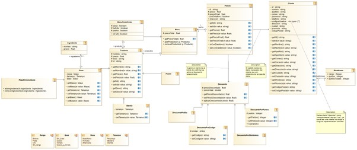

# GetPizza - Gestión de pizzería
Especificación de requisitos del software (SRS)

1. Introducción
  	Este documento es una Especificación de Requisitos Software (ERS) para el
  sistema GetPizza. Esta especificación se ha estructurado basándose en las
  directrices dadas por el estándar IEEE "Práctica Recomendada para
  Especificaciones de Requisitos Software IEEE 830, 1998".

  

  1.1 Propósito
  	Este proyecto tiene como objetivo crear una aplicación de escritorio con la cual
  poder pedir comida a domicilio, con la facilidad de no tener que visitar la tienda
  físicamente. Esta aplicación va dirigida a un público con poca disponibilidad o tiempo
  libre limitado que busque poder comer de forma cómoda y rápida teniendo la
  posibilidad de poder pagar el pedido en efectivo o con datáfono cuando el repartidor
  lo entregue.

  

  1.2 Alcance
  	El presente documento pretende definir las especificaciones de un sistema de
  información que gestiona por medio de credenciales inteligentes el acceso a
  visualizar menús, pedir comida a domicilio, acumular ofertas y conseguir un rango
  de membresía por medio de un sistema de puntos el cual será premiado por el
  sistema con descuentos.
  	El sistema GetPizza se centra en la gestión de visualizar menús, pedidos de
  comida a domicilio, acumulación de ofertas y el otorgamiento de un rango de
  membresía por medio de un sistema de puntos. El sistema está diseñado para ser
  utilizado por los clientes de la pizzería y se basa en el uso de credenciales
  inteligentes para garantizar la seguridad y privacidad de los usuarios.

  

  1.3 Visión general del documento
  	Este documento quiere dar una descripción general sobre el sistema, el cual está
  estructurado de acuerdo a las directrices proporcionadas por el estándar IEEE 830
  para Especificaciones de Requisitos Software. El documento contiene una
  descripción general del sistema, incluyendo la perspectiva del producto, las
  características de los usuarios, la descripción fundamental, las entidades de datos
  principales, las restricciones y las suposiciones y dependencias. Además, se
  incluyen los diagramas UML, los requisitos específicos del sistema, que se dividen
  en casos de uso y requisitos comunes de las interfaces.

2. Descripción general

  2.1 Perspectiva del producto
  	GetPizza es un sistema orientado a la realización de pedidos de un restaurante
  de pizzas, el cual consta de una aplicación para dispositivo móvil o de escritorio para la
  versión de ordenador de uso único para los clientes.

  

  2.2 Características de los usuarios
  	El sistema GetPizza permite a los clientes gestionar sus pedidos de comida a
  domicilio de forma eficiente. Los clientes comienzan el proceso iniciando sesión o
  registrándose en el sistema para acceder a una variedad de opciones, incluyendo la
  visualización de menús, la modificación de datos, la acumulación de ofertas o la
  obtención de una membresía por acumulación de puntos. Para realizar un pedido se
  añaden los productos, se escogen las ofertas y una forma de entrega. Por último, se
  pregunta el método de pago, bien pudiendo elegir que el repartidor lleve un datáfono
  para poder realizar el pago por tarjeta; o sin datáfono, para pagar en efectivo cuando el
  repartidor lleve el pedido.
  	Los casos de uso empleados para definir este proyecto son los siguientes en
  orden: 1) Registro en el sistema 2) Inicio de sesión 3) Modificación de datos 4) Visualizar
  carta 5) Visualizar membresía 6) Realizar pedido 7) Ver estado del pedido 8) Finalizar
  el pedido.

  

​		2.3 Descripción fundamental

| Tipo de usuario | Cliente                                                      |
| :-------------- | ------------------------------------------------------------ |
| Acciones        | Registrarse, iniciar sesión, modificar datos, visualizar carta,  visualizar membresía, aplicar descuentos, realizar, ver estado del pedido y finalizar el pedido. |

​		

​		2.4 Entidades de datos principales
​						⮚ Cliente (id, nombre completo, dirección, correo, password, teléfono,
​							códigosUsados)
​						⮚ Pedido (id, precio, precioFinal, estado, conDatafono, nota)
​						⮚ Descuento (tipos de descuento: DescuentoPorDia, DescuentoPorPuntos,
​							DescuentoPorMembresia, DescuentoPorCodigo; atributos: precioDescontado)
​						⮚ Código (descuento)
​						⮚ Producto (tipos de producto: pizza, postre, bebida; atributos: nombre, precio)
​						⮚ MenúPredefinido (pizza, postre, bebida, tipo de menú: personalizado,
​							predeterminado)
​						⮚ Pizza (tipo de pizza: predeterminada, personalizada)
​						⮚ Ingredientes (disponibilidad, nombre)
​						⮚ Membresía (rango, puntos, puntosTotales)
​						⮚ Carrito (precioTotal)

​		2.5 Restricciones
​						● Es necesario el uso de conexión a internet a la hora de usar la aplicación.
​						● Los servidores deben de ser capaces de soportar una gran afluencia de
​							información.
​						● El sistema debe tener un diseño simple, y ser fácil a la hora de usarlo, para
​							facilitar su uso.
​						● La aplicación debe de ser compatible con los principales sistemas operativos:
​							Android, IOS, Windows 10 Mobile, Firefox, Mac OS, Linux.
​				

​		2.6 Suposiciones y dependencias
​						● Es necesario que se cumplan los requisitos mencionados para asegurar un
​							correcto uso de la aplicación.
​						● El sistema GetPizza depende de una conexión a internet estable y confiable.
​							Además, se supone que los clientes tienen acceso a un dispositivo compatible
​							con el sistema y una cuenta de correo electrónico para registrarse.

3. Requerimientos Específicos
  3.1 Casos de uso

  ​	3.1.1 Registro en el sistema

  | CASO DE USO            | Registro_en_el_sistema                                       |
  | ---------------------- | ------------------------------------------------------------ |
  | Funcionalidad          | Registrar en el sistema al cliente que quiere realizar un pedido, ya que es necesario tener un usuario para realizar un pedido. |
  | Precondiciones         | Iniciar aplicación de GetPizza, la cual debe de estar previamente instalada. |
  | Postcondición si éxito | El sistema crea el usuario en la plataforma.                 |
  | Postcondición si fallo | El sistema indica el error y vuelve a pedir iniciar el proceso de registro. |
  | Secuencia normal       | Acción                                                       |
  | 1                      | El sistema muestra al cliente unos recuadros en donde le pide que introduzca sus datos de acceso al sistema: -correo electrónico -contraseña -confirmación de la contraseña Y le pide al cliente que introduzca también sus datos personales : - Nombre - Apellidos - Teléfono - Dirección - Ciudad - Provincia - Código postal Si ocurre un error al introducir los datos en el sistema (dependiendo del error, si los datos son incorrectos S-1 y si los datos están vacíos S-2). |
  | 2                      | El sistema registra al cliente. Si ocurre un error S-3       |
  | Secuencia alternativa  |                                                              |
  | S-1                    | Si hay algún tipo de error al introducir los datos el sistema mostrará “ Datos incorrectos” . El sistema devuelve al paso 1. |
  | S-2                    | Si ocurre este error se mostrará “Los datos no pueden ser vacíos” y se volverá a iniciar el proceso. El sistema devuelve al paso 1. |
  | S-3                    | Si hay un error al registrarse mostrará “El usuario ya está registrado “ y se volverá a iniciar el proceso. El sistema devuelve al paso 1. |

  

​	3.1.2 Inicio de sesión

4. Apéndices

​		4.1 Modelo de dominio

